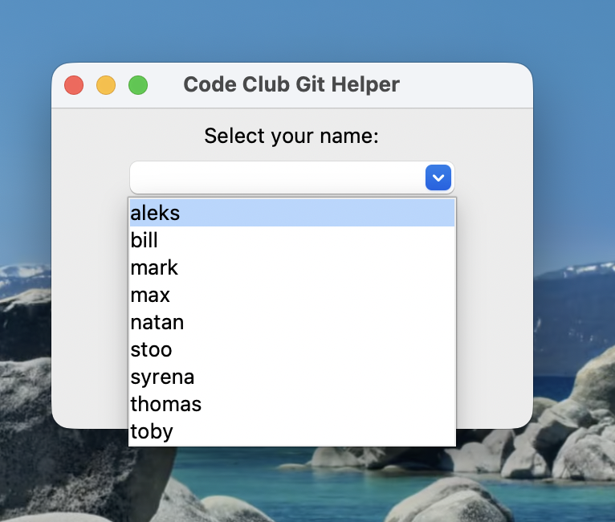
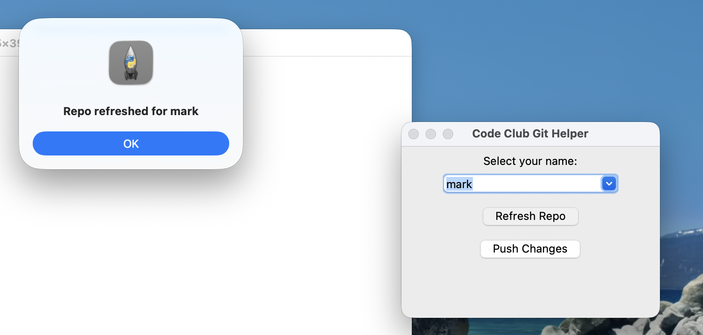
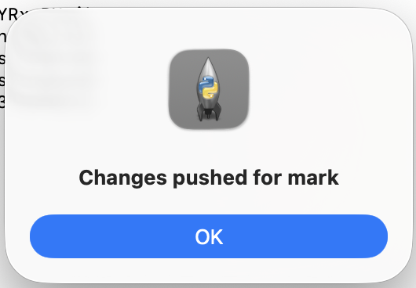

# Learn/Setup — files overview

This folder contains helper scripts and a small GUI used by Lichfield Code Club to manage a shared `learn` repository and local Git credentials. Below is a short summary of each file (excluding `welcome.md`).

- `gh-login` — A small shell wrapper that logs into GitHub CLI using a personal access token stored at `~/.github.pat`.
  - Usage: run `./gh-login` (may need execute permission). It calls `gh auth login --with-token` with the token redirected from the file.

- `learn-get.sh` — Script to clone or refresh the `learn` repository for a member and switch to a branch named after the member.
  - Behavior: creates the target directory (`$HOME/workspace/learn`), removes any existing copy, clones the repo from `https://github.com/Lichfield-Code-Club/learn.git`, then checks out the branch matching the provided member name. If the branch does not exist remotely it creates it locally and pushes it upstream.
  - Example: `./learn-get.sh al e ks` (pass the member name as the first argument).

- `learn-put.sh` — Script to commit and push local changes for a given member branch.
  - Behavior: ensures the script is run from the repo directory (`$HOME/workspace/learn`), switches to the specified member branch, stages all changes, commits with a timestamped message when there are staged changes, and pushes to the remote. Logs actions to `$HOME/workspace/learn/log/push.log`.
  - Example: `./learn-put.sh al e ks` (pass the member name as the first argument).

- `learn.py` — A minimal Tkinter GUI that presents a dropdown of hardcoded member names and two buttons:
  - "Refresh Repo": runs `learn-get.sh <member>` to clone/switch to the member branch.
  - "Push Changes": runs `learn-put.sh <member>` to commit and push changes.
  - Notes: the script currently references the helper scripts with hardcoded paths. Update paths as needed for your environment.

- `osxkeychain.sh` — One-line convenience file to set Git's credential helper to the macOS Keychain:
  - `git config --global credential.helper osxkeychain`

Permissions and safety
- Some scripts may not be executable by default; make them executable with `chmod +x <script>`.
- Review scripts before running. `learn-get.sh` removes the target repo directory before cloning.

Contact
- If you maintain this folder, update this README with any changes to script behavior or paths.

Screenshots
---------------
This folder includes several PNG helpers used to show how to run the `learn.py` GUI and what to expect when using it. They are small annotated images intended for quick user guidance:

- `desktop-icon.png` — Indicates which desktop icon users should click to launch the `learn.py` GUI. Use this if you create a shortcut or app wrapper for the Tkinter script.

  

- `helper-1.png` — Shows the GUI with the member dropdown highlighted. This demonstrates how to select your username (which maps to the Git branch the scripts will use).

  

- `helper-2.png` — Example output after pressing "Refresh Repo". It illustrates the terminal or status messages you will see when the repo is cloned/refreshed and the member branch is checked out.

  

- `helper-3.png` — Example output after saving or pushing changes with "Push Changes". It shows the confirmation or log output produced when changes are committed and pushed for the selected member branch.

  

Tip: include these images in any quickstart or onboarding documentation so new users can follow the exact sequence: click the desktop icon, select your name, refresh to get the latest repo, edit files, then push changes.
